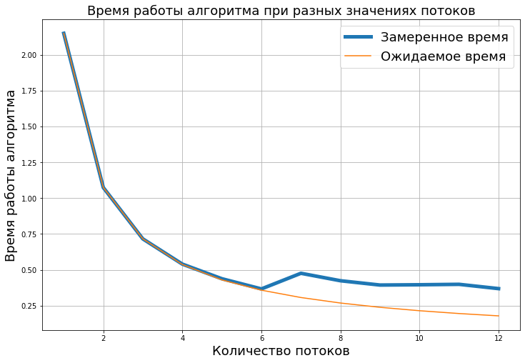

# Распараллеленный расчет числа пи методом интегрирования функции $\frac{4}{1+x^2}$
  

# Постановка задачи 
\
Как известно, число пи можно определять очень большим числом способов. \
Одним из таковых является его определение как интеграл $\int_{0}^{1}\frac{4}{1+x^2}dx=4arctg(x)|_0^1=\pi$ \
\
Численно данный интеграл можно считать разными способами, среди которых реализованные мной методы левых прямоугольников  $\int_{0}^{1}\frac{4}{1+x^2}dx\approx\sum_{i=0}^{N}f(x_i)(x_{i+1}-x_i)$, дающий ошибку порядка O(h) \
И метод трапеций $\int_{0}^{1}\frac{4}{1+x^2}dx\approx\sum_{i=0}^{N}\frac{1}{2}(f(x_{i+1})- f(x_i))(x_{i+1}-x_i)$, дающий ошибку порядка O(h^2) на равномерной сетке, где h - размер этой самой сетки

# Запуск
Для запуска методом прямоугольников: 
```
/pi_rectangle.sh #числоточек #числопотоков
```
Для запуска методом трапеций : 
```
/pi_trapez.sh #числоточек #числопотоков
```

Можно не вводить число точек и потоков, тогда по умолчанию будут выставлены 100_000_000 точек и 1 поток

В результате программа выдаст рассчитанное число пи, разницу между ним и реальным значением и время работы 

# Результатыs
| Параметр | Значение |
| :--- | :--- |
| **Процессор** | Ryzen 5 5600H |
| **Конфигурация процессора** | 6 ядер, 12 потоков |
| **Операционная система** | Linux (Ubuntu 22.04) |


| Число процессов | Время работы, c | Ожидаемое время работы, c |
| :---: | ---: | ---: |
| 1 | 2.149 | 2.149 |
| 2 | 1.074 | 1.075 |
| 3 | 0.716 | 0.716 |
| 4 | 0.540 | 0.537 |
| 5 | 0.438 | 0.430 |
| 6 | 0.367 | 0.358 |
| 7 | 0.476 | 0.307 |
| 8 | 0.424 | 0.269 |
| 9 | 0.394 | 0.239 |
| 10 | 0.396 | 0.215 |
| 11 | 0.399 | 0.195 |
| 12 | 0.369 | 0.179 |

